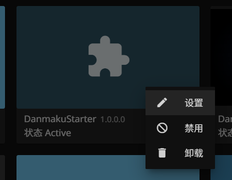
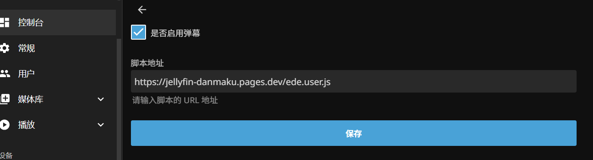

# Jellyfin Web Danmaku Starter


一种简化的方式，通过一个插件给 Jellyfin 添加 Web 弹幕功能。

功能的本体来自这里：https://github.com/Izumiko/jellyfin-danmaku

作者给出的几种安装方式都需要动一下代码，

于是有了本项目，理论上不需要打开电脑，手机上就能完成这个功能的安装。


# 安装

在Jellyfin的插件管理页面，添加一个新的插件“存储库”地址：

```
https://github.com/yomunsam/Jellyfin.WebDanmakuStarter/raw/master/manifest.json
```

随后搜索并安装“WebDanmakuStarter”插件，之后重启Jellyfin服务器即可。

一些互联网不便地区，可尝试使用镜像加速(来自第三方工具)
```
https://www.ghproxy.cn/https://raw.githubusercontent.com/yomunsam/Jellyfin.WebDanmakuStarter/refs/heads/master/manifest.json
```

<br>

# 在设置中切换

打开插件设置界面



通过勾选开关，**保存后重启Jellyfin服务器**可切换是否启用弹幕功能。



如果你想卸载插件，可能要先关闭弹幕功能并重启一次，然后再卸载插件。
